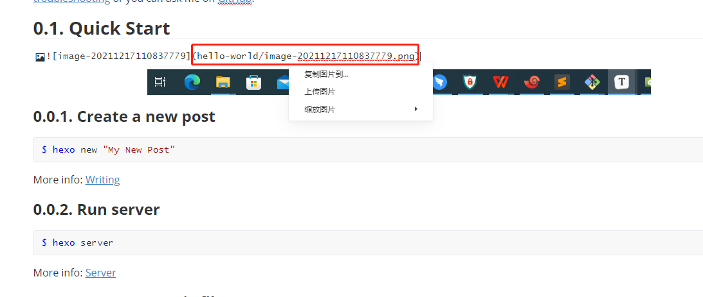

# hexo-typora-asset
 hexo兼容typora插入相对路径的图片

使用方法

1. hexo 站点配置文件更新`post_asset_folder: true`

2. 安装插件 

   ```bash
   npm install hexo-typora-asset --registry https://registry.npmjs.org --save
   ```

3. typora更新插入图片的存储路径

   

4. 重新渲染网站

   ```bash
   hexo clean
   hexo g
   ```

# 面临的问题

## 启动hexo

```bash
$ hexo init tet
INFO  Cloning hexo-starter https://github.com/hexojs/hexo-starter.git
INFO  Install dependencies
INFO  Start blogging with Hexo!
```

```bash
$ cd tet/

rwx@DESKTOP-ERVFN4B MINGW64 /c/tet
$ ls
_config.landscape.yml  node_modules/      package.json  source/
_config.yml            package-lock.json  scaffolds/    themes/
```

进入hexo页面

```bash
rwx@DESKTOP-ERVFN4B MINGW64 /c/tet
$ hexo s
INFO  Validating config
INFO  Start processing
INFO  Hexo is running at http://localhost:4000 . Press Ctrl+C to stop.

```

> 访问本地的 http://localhost:4000
>
> 

## 添加图片不显示

来到hexo的站点目录

```bash
rwx@DESKTOP-ERVFN4B MINGW64 /c/tet
$ start .
```

切换到source目录下，有一个hello world.md


通过typora打开，并配置图片的插入目录


我们插入一个随机的图片, 直接截图粘贴到typora中



>  我们插入的图片为``

现在看浏览器, 不显示


> F12 devtool观察图片的引用路径, ``
>
> 

现在我们在终端中执行渲染, 并不会显示

```bash
hexo g
```

> 

## 通过hexo的站点配置渲染静态文件

```bash
rwx@DESKTOP-ERVFN4B MINGW64 /c/tet
$ notepad++ _config.yml
```


> `post_asset_folder: true`

现在重新渲染

```bash
hexo clean
hexo g
```


查看index.html

```bash
grep img public/2021/12/17/hello-world/index.html
```

> 

现在只需要将src的目录中的前缀hello world去掉，即可以查看。

先验证当前的hexo s不可以展示 

```bash
rwx@DESKTOP-ERVFN4B MINGW64 /c/tet
$ hexo s
INFO  Validating config
INFO  Start processing
INFO  Hexo is running at http://localhost:4000 . Press Ctrl+C to stop.

```


# hexo-typora-asset

在站点目录下，安装插件

```bash
rwx@DESKTOP-ERVFN4B MINGW64 /c/tet
$ ls
_config.landscape.yml  db.json            package.json  source/
_config.yml            node_modules/      public/       themes/
_config.yml.bak        package-lock.json  scaffolds/

rwx@DESKTOP-ERVFN4B MINGW64 /c/tet
$ npm install hexo-typora-asset --registry https://registry.npmjs.org --save

added 1 package, and audited 250 packages in 19s

15 packages are looking for funding
  run `npm fund` for details

1 moderate severity vulnerability

Some issues need review, and may require choosing
a different dependency.

Run `npm audit` for details.
```

> 站点配置文件`_config.yaml`, 需要打开选项 `post_asset_folder: true`

之后，再渲染

```bash
rwx@DESKTOP-ERVFN4B MINGW64 /c/tet
$ hexo clean
INFO  Validating config
INFO  Deleted database.

```

```bash
$ hexo g
INFO  Validating config
INFO  Start processing
INFO  Files loaded in 188 ms
(node:21528) Warning: Accessing non-existent property 'lineno' of module exports inside circular dependency
(Use `node --trace-warnings ...` to show where the warning was created)
(node:21528) Warning: Accessing non-existent property 'column' of module exports inside circular dependency
(node:21528) Warning: Accessing non-existent property 'filename' of module exports inside circular dependency
(node:21528) Warning: Accessing non-existent property 'lineno' of module exports inside circular dependency
(node:21528) Warning: Accessing non-existent property 'column' of module exports inside circular dependency
(node:21528) Warning: Accessing non-existent property 'filename' of module exports inside circular dependency
INFO  Generated: archives/index.html
INFO  Generated: archives/2021/index.html
INFO  Generated: archives/2021/12/index.html
INFO  Generated: fancybox/jquery.fancybox.min.css
INFO  Generated: index.html
INFO  Generated: js/script.js
INFO  Generated: css/fonts/fontawesome-webfont.eot
INFO  Generated: css/style.css
INFO  Generated: js/jquery-3.4.1.min.js
INFO  Generated: fancybox/jquery.fancybox.min.js
INFO  Generated: css/fonts/FontAwesome.otf
INFO  Generated: css/images/banner.jpg
INFO  Generated: css/fonts/fontawesome-webfont.woff2
INFO  Generated: css/fonts/fontawesome-webfont.ttf
INFO  Generated: css/fonts/fontawesome-webfont.woff
INFO  Generated: 2021/12/17/hello-world/image-20211217110837779.png
INFO  Generated: 2021/12/17/hello-world/index.html
INFO  Generated: css/fonts/fontawesome-webfont.svg
INFO  18 files generated in 578 ms
```

```bash
$ grep img public/2021/12/17/hello-world/index.html
<h2 id="Quick-Start"><a href="#Quick-Start" class="headerlink" title="Quick Start"></a>Quick Start</h2><p></p>
```

> 现在的图片没有相对路径了

我们直接打开这个渲染的网页, 双击下面的index.html


现在就可以看到图片了


